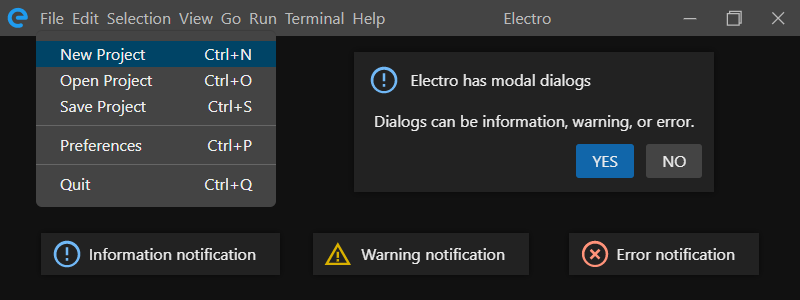

<!--
Electro - A basic single page Electron application template.
Copyright (c) Cliff Earl, Antix Development, 2022.
MIT License:
-->

<div align="justify">

# Electro



### About

Electro is a single page ElectronJS application template primarily for Windows OS that attempts to mimic the functionality and behavior of a real window, with an appearance similar to that of Visual Studio Code. The reason it exists is to serve as a minimal single page ElectronJS based template for my personal use, and I have made it publicly available on the off chance that somebody else might find it of use, be that practical or educational.

Electro adheres to a standard model for a secure ElectronJS application, having a main process managing Electron tasks, a renderer process containing the main application logic, and a preload process which facilitates inter-process communication between them.

As well as providing a basic user interface with menus, modal dialogs, and popup notifications, Electro also contains several utility methods to facilitate local file access. All of these features combinbed mean you can get started on your actual application and let Electro take handle the routine tasks.

If you end up using Electro, let me know, I would love to see what you do with it. Maybe you would also consider [buying me a coffee](https://www.buymeacoffee.com/antixdevelu) :)

<hr>

### Strengths and Weaknesses

As with all things in life, nothing is perfect, and Electro is no different in that regard.

**Strengths**

- Mostly complete ability to mimic a real windows behavior.
- Small and unconfusing code base compared to competing products.
- Is Relatively customizable.
- Better documentation that competing products.
- Easy to use compared to other products.
- Built in utility features for basic local file access.
- Loads CSS and generates HTML internally so index.html and style.css are relatively unpolluted.
- A self contained module so renderer.js is relatively unpolluted.
- Doesn't depend or include on any other modules or frameworks so you can add your own and go.

**Weaknesses**

- Not as complete as competing products.
- Is based on the *"single page application"* philosophy.
- Not tested with 3rd party frameworks.
- Not as customizable as competing products.
- Mac not really supported due to not owning one.
- Not as many *"bells and whistles"* as competing products.
- `alt` keypress doesn't initiate keyboard menu navigation.
- Only one level of menus are implemented (no sub-menus).

<hr>

### Getting started with Electro

If you are using Visual Studio Code then then getting started is fairly straightforward..

1. Download this repository as a zip file.
2. Unzip downloaded file into your projects folder.
3. Rename the folder to whatever your application will be called.
4. Open the folder in VSCode.
5. Run `npm init`.

From there you can start creating your application by editing `index.html`, `renderer.js`, and `style.css`.

> *NOTE:* Your mileage may vary for other IDE's.

> *NOTE:* Electro is pre configured with two launch configurations, *"Run Electron Main"*, and *"Debug Electron Main"*. Electro is also setup to build using Electron-Forge.

The following example shows how to use the core features of Electro and hopefully demonstrates how easy it is to use...

```
import * as electro from './modules/electro/electro.js';

// Initialize Electro before calling any of its methods
electro.initialize();

// Define a simple menu and attach it to the title bar
const myMenus = [
  {
    label: 'Test Menu', // Menu label
    items: [ // Menu items
      { // Menu item
        label: 'Test Item',
        key: 'T',
        comboKeys: electro.TYPE_CTRL,
        click: () => console.log('test item activated'),
      },
    ]
  },
];
electro.setMenus(myMenus);

// Define some colors and set them
const myColors = {
  title_label:        'bbb', // Title bar title color
  menu_label:         'bbb', // Menu label color
  item_label:         'eee', // Menu item label color
  item_highlight:     '046', // Menu item highlight (hover) color
  separator:          '666', // Menu separator bar color
};
electro.setColors(myColors);

// Change the title bar label
electro.setTitle('My Electro App');

// Change the title bar icon
electro.setIcon('img/my-app-icon.svg');

// Change the title bar font
electro.setFont('Segoe UI');

// 
// Optionally you can setup everything when calling `initialize` like so...
// 

electro.initialize({
  icon: 'img/my-app-icon.svg',
  title: 'My Electro App',
  menus: myMenus,
  colors: myColors,
  font: 'Segoe UI',
});

// Show a popup notification
electro.notify('Electro online');

// Show a modal dialog
electro.dialog({
  title: 'Dialog Title',
  body: 'Dialog Body',
  singleButton: true
});
```
Let's examine each of the methods used in the example (and more) in more detail...

---

### Electro API

##### Core Methods

Electro contains the following core methods...

`initialize(options)` 

*Initialize the Electro module.*

@param {object} options

Basically `initialize` loads electro.css, attaches it to the head of `index.html`, creates HTML elements and appends them to the body of `index.html`, and installs various event handlers.

If you supply options, `initialize` will setup menus, icons, and so forth as required. Valid options are as follows...

```
electro.initialize({
  icon: 'my-icon.svg',
  title: 'My Electro App',
  menus: myMenus,
  colors: myColors,
  font: 'Segoe UI',
});
```

> *NOTE:* You only need to include any of the above options you you want to set.

<br>

`quitApplication()`

*Closes the Electro application.*

<br>

`enableConfig(state = true)`

@param {boolean} state

*Enable or disable Electro configuration.*

When config is enabled, Electro will persist its window dimensions and position between sessions.

> *NOTE:* Electro will NOT save window dimensions and position if the window is minimized or in fullscreen mode.

<br>

`setMenus(menus)`

*Set title bar menus using the given array of menu objects*

@param {[object]} menus

`menus` is an array of menu objects, whose structure is as follows...

```
{ // Menu start
  label: 'File', // Menu title

  items: [ // Menu items start

    { // Item start
      label: 'New Project', // Item label
      key: 'N', // Hotkey that activates this menu item
      comboKeys: TYPE_CTRL, // Extra keys required to activate hotkey
      click: () => console.log('clicked'), // Code executed on click or hotkey activation
    }, // Item end

  ] // Menu items end

} // Menu end
```

Combokeys is a combination (logical OR) of any of the following...
```
TYPE_NONE
TYPE_CTRL
TYPE_ALT
TYPE_SHIFT
TYPE_META // Mac "command" key
```

> *NOTE:* Electro will replace `TYPE_CTRL` with `TYPE_META` on Mac.

> *NOTE:* Empty objects in a menus `items` array will be considered a horizontal menu separator.

> *NOTE:* Calling `setMenus` will overwrite any menus currently attached to the title bar.

<br>

`setColors(colors)`

*Set one or more colors.*

@param {object} colors

`colors` is an object with the following structure...

```
{
  title_background:   '444', // Title bar background color, inherited by all children
  title_label:        'bbb', // Title bar title color
  highlight:          '555', // Highlight (hover) color for title bar elements except window close button
  menu_label:         'bbb', // Menu label color
  item_label:         'eee', // Menu item label color
  item_highlight:     '046', // Menu item highlight (hover) color
  separator:          '666', // Menu separator bar color
  close_highlight:    'd12', // Highlight (hover) color for window close button
  notify_background:  '222', // Notification background color
  notify_text:        'bbb', // Notification text color
  dialog_background:  '222', // Dialog background color
  dialog_text:        'bbb', // Dialog text color
  dialog_yes:         '16a', // Dialog yes button color
  dialog_no:          '444', // Dialog no button color
}
```

The code above shows the valid color names, and their default values (as can be found in the `:root` of electro.css).

> *NOTE:* The color strings themselves are just HTML color strings without the "#" character.

> *NOTE:* You only need to include any of the above colors you you want to set.

<br>

`setTitle(title)`

*Set the windows title.*

@param {string} title

<br>

`setIcon(name)`

*Set the applications icons.*

@param {string} name

Electro will change both the title bar and task bar icons using the name passed. Basically this means that if you pass in the name *"img/icon.svg"*, then there must also exist (in the same path) a corresponding icon file *"icon.icns"* (Mac), *"icon.ico"* (Windows), or *"icon.png"* (Linux).

This is slightly confusing and mildly annoying but *must* be this way because the ElectronJS `setIcon` method does not support anything but PNG, JPG, ICO, and ICNS files.

> *NOTE:* If the corresponding icon file does not exist, Electro will overwrite both icons with it's own default ones.

<br>

`setFont(name)`

*Set the windows font.*

@param {string} name

<br>

`setTitle(title)`

*Set the windows title.*

@param {string} title

<br>

`resizeCallback(callback)`

*Set the window resized callback.*

@param {function} callback

Once set, your callback function will be executed on an Electro window resize event and passed a string specifying the type of event, which will be one of the following...

```
'entered-full-screen'
'exited-full-screen'
'maximized'
'unmaximized'
'minimized'
'restored'
```

> *NOTE:* You only need to set a callback if you need to do something when the Electro window resizes.

---

#### Dialogs and Notifications

Electro includes methods to enable the display of modal dialogs and popup toast-like notifications.

`notify(text, type = TYPE_INFORMATION)`

*Displays the given text in a popup notification of the given type.*

@param {string} text
@param {number} type

There are three valid types
```
electro.TYPE_INFORMATION
electro.TYPE_WARNING
electro.TYPE_ERROR
```

<br>

`dialog(options)`

*Displays a modal dialog using the given options.*

@param {object} options

Valid options are as follows...

```
{
  title: 'Math quiz', // Defaults to an empty string if not present
  body: 'One multiplied by five equals three', // Defaults to an empty string if not present
  type: electro.TYPE_INFORMATION, // defaults to `TYPE_INFORMATION` if not present
  yesText: 'True', // Defaults to "YES" if not present
  yesCallback: () => console.log('stupid'), // Defaults to `null` if not present
  noText: 'False', // Defaults to "NO" if not present
  noCallback: () => console.log('clever'), // Defaults to `null` if not present
  singleButton: true // Only yes button will be visible, defaults to `false` if not present
}
```

> *NOTE:* `dialog` uses the same types as `notify`...

> *NOTE:* Any hyperlinks in the body of the dialog will be opened using the systems default web browser.

> *NOTE:* Passing no `options` will result in the worlds most useless dialog :D

---

##### Native Dialogs

Electro provides a number methods to enable selection of file and folders from the local file system by levaraging the ElectronJS Dialog API (https://www.electronjs.org/docs/latest/api/dialog). All native dialog methods are of the synchronous variety.

> *NOTE:* The default filter for all dialogs will show all files (`{name: 'All Files', extensions: ['*']}`), and the default path will be the current process directory (as retrieved by `electro.currentDirectory`).

<br>

`showSingleFileDialog(options)`

*Show an open file dialog where only one file can be selected.*

@param {object} options
@returns {string} filename, or null

`options` is an object containing any of the following optional parameters...

```
{
  title: 'Dialog Title',
  filter: {name: 'All Files', extensions: ['*']}, // An ElectronJS style filter
  path: 'c:\temp', // Path that the dialog will start in
}
```

https://www.electronjs.org/docs/latest/api/structures/file-filter

https://www.electronjs.org/docs/latest/api/dialog#dialogshowopendialogsyncbrowserwindow-options

<br>

`showMultipleFileDialog(options)`

*Show an open file dialog where multiple files can be selected.*

@param {object} options
@returns {[string]} Array of filenames, or null

`options` is an object containing any of the following optional parameters...

```
{
  title: 'Dialog Title',
  filter: {name: 'All Files', extensions: ['*']}, // An ElectronJS style filter
  path: 'c:\temp', // Path that the dialog will start in
}
```

https://www.electronjs.org/docs/latest/api/structures/file-filter

https://www.electronjs.org/docs/latest/api/dialog#dialogshowopendialogsyncbrowserwindow-options

<br>

`showSaveFileDialog(options)`

*Show a save file dialog where one file can be entered.*

@param {object} options
@returns {string} filename, or null

`options` is an object containing any of the following optional parameters...

```
{
  title: 'Dialog Title',
  filter: {name: 'All Files', extensions: ['*']}, // An ElectronJS style filter
  path: 'c:\temp', // Path that the dialog will start in
}
```

https://www.electronjs.org/docs/latest/api/structures/file-filter

https://www.electronjs.org/docs/latest/api/dialog#dialogshowsavedialogsyncbrowserwindow-options

---

##### Native File System Access

Electro provides a number methods to enable basic file system interaction on the local machine. These methods leverage the NodsJS filesystem (https://nodejs.org/api/fs.html) and path https://nodejs.org/api/path.html APIs. All native file system methods are of the synchronous variety.

<br>

`exists(path)`

*Determines if the file with the given path exists.*

@param {string} path
@return {boolean} exists

https://nodejs.org/api/fs.html#fsexistssyncpath

<br>

`deleteFile(path)`

*Deletes the file at the given path.*

@param {string} path

https://nodejs.org/api/fs.html#fsunlinksyncpath

<br>

`createFolder(path)`

*Create the folder with the given path.*

@param {string} path

https://nodejs.org/api/fs.html#fsmkdirsyncpath-options

<br>

`fileInfo(path)`

*Get information about the file with the given path.*

@param {string} path
@return {object}

> *NOTE:* See https://nodejs.org/api/path.html#pathparsepath for the structure of the returned object

<br>

`currentDirectory(path)`

*Sets or gets the current directory.*

@param {string} path default is null
@return {string} current directory, or null if the current directory ws unable to be changed

Calling `currentDirectory` with no parameter will result in the current directory being returned (get).

Calling `currentdirectory` with a path will cause the current directory to be changed (set).

https://nodejs.org/api/process.html#processcwd

https://nodejs.org/api/process.html#process_process_chdir_directory

<br>

`newFileName(...parts)`

*Create a new filename from the given parts.*

@param {...string} ...parts An arbitrary number of strings
@return {string} filename

The resulting filename will have the correct separators for various operating systems.

https://nodejs.org/api/path.html#pathjoinpaths

<br>

`loadTextFile(path)`

*Load the text file with the given path.*

@param {string} path
@return {string} text

https://nodejs.org/api/fs.html#fsreadfilesyncpath-options

<br>

`saveTextFile(path)`

*Save the given text to a file with the given path.*

@param {string} path
@param {string} text

https://nodejs.org/api/fs.html#fswritefilesyncfile-data-options

<br>

`saveBinaryFile(path)`

*Save the given binary data to a file with the given path.*

@param {string} path
@param {string} text

https://nodejs.org/api/fs.html#fswritefilesyncfile-data-options

<br>

`saveCanvas(path, dataURL)`

*Save the given dataURL to a PNG file with the given path.*

@param {string} path
@param {string} dataURL

`dataURL` is a data URL obtained by calling `HTMLCanvasElement.toDataURL()`.

https://developer.mozilla.org/en-US/docs/Web/API/HTMLCanvasElement/toDataURL

> *NOTE:* `saveCanvas()` leverages Electron's `nativeImage` module.

https://www.electronjs.org/docs/latest/api/native-image

